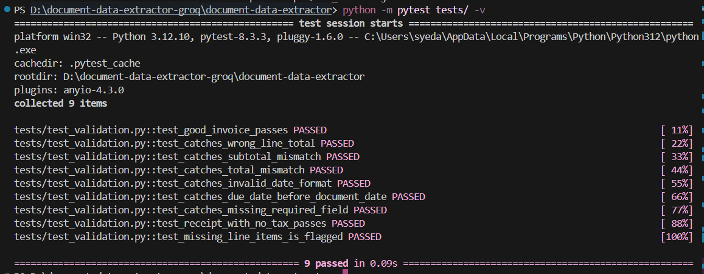
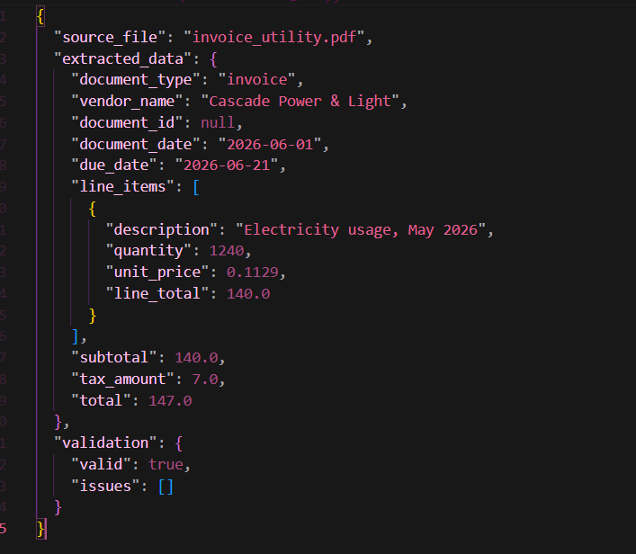

# Document Data Extractor

Pulls structured fields (vendor, dates, line items, totals) out of business
documents — invoices, receipts, purchase orders — and turns them into
validated JSON. Built for the Rooman Technologies 24-Hour AI Agent
Challenge (Category 2, Advanced tier).

**This agent takes a PDF business document and produces validated,
structured JSON of its key fields, with independent sanity checks run in
plain Python (not the AI) to catch extraction errors.**

> **The core idea in one line:** the LLM extracts, Python verifies. Two
> separate systems have to agree before a document is marked valid.

---
---

## Screenshots

**Running the extractor:**


**Test suite passing:**


**Sample extracted output:**


---


## Quick start

```bash
cd document-data-extractor
pip install -r requirements.txt

# add your key (free, no card) — get one at console.groq.com
echo "GROQ_API_KEY=gsk_your-key-here" > .env

python main.py
```

That's it — it processes every PDF in `sample_documents/` and writes
validated JSON to `output/`.

---

## What this satisfies (brief checklist)

| Expected capability | How it's covered |
|---|---|
| Read a document and extract key fields | `pdfplumber` → LLM extraction against a fixed schema (dates, amounts, line items, IDs) |
| Output validated, well-structured JSON | Every result is `{extracted_data, validation}`, written to `output/*.json` |
| Sanity checks (totals, dates) | `validation.py` — 4 independent arithmetic/date checks, unit-tested |
| Handle 2+ document layouts | 8 sample PDFs across 6 genuinely different layouts (see table below) |
| Sample documents with varied layouts | `sample_documents/` |
| Extracted JSON for each document | `output/` |
| Note on validation logic & failure cases | See [Validation logic](#validation-logic-validationpy) and [Known failure cases](#known-failure-cases--limitations) below |

---

## How it works

```
PDF file
   |
   v
pdfplumber extracts raw text (layout-aware)
   |
   v
The model reads the text, returns structured JSON
   (vendor, dates, line items, totals) per a fixed schema
   |
   v
validation.py independently re-checks the JSON with plain arithmetic:
   - do line items sum to the subtotal?
   - does subtotal + tax = total?
   - are the dates real, valid calendar dates?
   - is due_date after document_date?
   - are all required fields present?
   |
   v
output/<filename>.json  (extracted data + validation report)
```

The key design decision: **the LLM extracts, Python verifies.** The model
(Llama 3.3 70B, via Groq's free API) is good at reading messy,
unstructured text and mapping it to a schema. It is not reliably good at
arithmetic. So none of the "is this document internally consistent"
logic is delegated to the model — it's plain Python in `validation.py`,
unit-tested independently of any API call.

---

## Setup

```bash
cd document-data-extractor
pip install -r requirements.txt
```

Get a free API key at [console.groq.com](https://console.groq.com) →
API Keys → Create Key (no credit card required). Then either:

```bash
export GROQ_API_KEY=gsk_your-key-here
```

or copy `.env.example` to `.env` and fill in the key — `main.py` loads it
automatically via `python-dotenv`.

## Running it

Eight sample documents with deliberately different layouts are already in
`sample_documents/` (see [Sample documents](#sample-documents) below for
how they were made).

```bash
# Process every PDF in sample_documents/
python main.py

# Process a single file
python main.py sample_documents/invoice_acme.pdf
```

This writes one JSON file per document to `output/`, plus a combined
`output/all_results.json`.

## Example output (real model run)

This is actual output from `python main.py` against
`invoice_acme.pdf` — not a hand-built mock:

```json
{
  "source_file": "invoice_acme.pdf",
  "extracted_data": {
    "document_type": "invoice",
    "vendor_name": "ACME Industrial Supply Co.",
    "document_id": "INV-2026-0447",
    "document_date": "2026-06-03",
    "due_date": "2026-07-03",
    "line_items": [
      { "description": "Galvanized Steel Bolt (M10)", "quantity": 500, "unit_price": 0.42, "line_total": 210.00 },
      { "description": "Industrial Hinge, Heavy Duty", "quantity": 40, "unit_price": 6.75, "line_total": 270.00 },
      { "description": "Safety Gloves (Pair)", "quantity": 60, "unit_price": 3.20, "line_total": 192.00 },
      { "description": "Epoxy Sealant, 500ml", "quantity": 15, "unit_price": 11.99, "line_total": 179.85 }
    ],
    "subtotal": 851.85,
    "tax_amount": 51.11,
    "total": 902.96
  },
  "validation": { "valid": true, "issues": [] }
}
```

Walking through why `validation.valid` is `true` here: `210.00 + 270.00 +
192.00 + 179.85 = 851.85` (matches `subtotal`), and `851.85 + 51.11 =
902.96` (matches `total`) — both checked independently in Python, not
just trusted from the model.

## Sample documents

`generate_samples.py` creates **8 PDFs across 6 genuinely different
layouts** — meeting both the general brief's "5-10 real examples" step
and the Advanced tier's "at least two layouts" deliverable with real
margin to spare:

| File | Type | Layout notes | Tax line | Notable edge case |
|---|---|---|---|---|
| `invoice_acme.pdf` | Invoice | Full-page tabular, ISO date already | 6%, present | Baseline case |
| `receipt_cornerstore.pdf` | Receipt | Narrow receipt strip | Absent | `MM/DD/YYYY` date needs normalizing |
| `po_northwind.pdf` | Purchase Order | Tabular, ship-to + delivery date instead of due date | 8.5%, present | Different field set than an invoice |
| `invoice_freelance.pdf` | Invoice | Hourly billing (qty = hours, not units) | Absent (sole proprietor) | Line items priced by hours, not pieces |
| `receipt_diner.pdf` | Receipt | Restaurant check | $0.00 (explicit zero-rate line, not absent) | Tests "tax line present but zero" vs. "no tax line at all" |
| `invoice_utility.pdf` | Invoice | Single line item, no table header row at all | 5%, present | Non-tabular layout, prose-style line item |
| `invoice_saas.pdf` | Invoice | Subscription billing | **None** — states "N/A, tax-exempt" as text | Tests that the model reports `null`, not a hallucinated number, when tax is explicitly non-numeric |
| `receipt_hardware.pdf` | Receipt | Retail receipt | 7.3%, present | Comma-formatted price parsing (`$1,188.00` on the SaaS invoice; multi-qty lines here) |

This matters because the "handle multiple layouts" requirement is easy
to fake by just changing the vendor name on a copy-pasted template. These
eight differ in date format, tax presence (absent vs. explicit zero vs.
non-numeric text), field sets (due date vs. delivery date), and
structure (tabular vs. prose-style single line item) — which exercises
real edges in both the extraction prompt and the validator, not just
cosmetic variation.

## Validation logic (`validation.py`)

Four independent checks, all pure Python / no model calls:

1. **Required fields present** — document_type, vendor_name, document_date,
   total, line_items must all exist and be non-empty.
2. **Dates are valid** — any date field present must parse as a real
   ISO (`YYYY-MM-DD`) calendar date; `due_date` can't be before
   `document_date`.
3. **Line items sum correctly** — `quantity * unit_price` must match each
   line's `line_total`, and the sum of line totals must match `subtotal`.
4. **Subtotal + tax = total** — arithmetic check on the final total,
   tolerant of a 2-cent rounding margin.

Each check returns human-readable issue strings rather than just a
pass/fail flag, so a reviewer (or a human fixing the data) can see
exactly what's wrong and where.

Tested independently in `tests/test_validation.py` — 9 tests covering
correct data and every failure mode above (wrong line math, bad
subtotal, bad total, invalid date string, due-date-before-document-date,
missing required field, missing line items, and — importantly — a
receipt with **no** tax line, which should pass, not fail, since not
every document has tax). Run with:

```bash
python -m pytest tests/test_validation.py -v
```

```
tests/test_validation.py::test_good_invoice_passes PASSED
tests/test_validation.py::test_catches_wrong_line_total PASSED
tests/test_validation.py::test_catches_subtotal_mismatch PASSED
tests/test_validation.py::test_catches_total_mismatch PASSED
tests/test_validation.py::test_catches_invalid_date_format PASSED
tests/test_validation.py::test_catches_due_date_before_document_date PASSED
tests/test_validation.py::test_catches_missing_required_field PASSED
tests/test_validation.py::test_receipt_with_no_tax_passes PASSED
tests/test_validation.py::test_missing_line_items_is_flagged PASSED
9 passed in 0.08s
```

These tests don't need an API key — they test the validator directly
against hand-constructed data, including deliberately broken data, which
is how the validation logic was confirmed to actually *catch* errors
rather than rubber-stamp everything.

## Tradeoffs & design choices

- **Text extraction, not vision.** `pdfplumber` pulls text and sends it
  as text to the model, rather than sending page images to a vision
  model. This is faster/cheaper and works well for born-digital PDFs
  like these samples. It would **not** work on scanned/photographed
  documents where the "text" is actually pixels — that needs OCR
  (`pytesseract`) as a pre-processing step first, which is out of scope
  for the 24-hour build.
- **Groq (Llama 3.3 70B), not a paid API.** The brief explicitly lists
  "a free model via Groq/Ollama" as an acceptable option. Groq's free
  tier needs no credit card and comfortably covers this workload (14,400
  requests/day vs. 8 documents here). Tradeoff: Llama 3.3 is somewhat
  less reliable at strict JSON-schema adherence than a frontier model,
  which is part of why the independent Python validation layer matters
  — it catches what schema drift would otherwise let through silently.
- **One LLM call per document**, not multiple passes. A more robust
  version might do a first pass to extract, then a second "critic" pass
  where the model re-checks its own output against the source text. This
  was skipped for time — the Python validation layer catches the
  arithmetic errors a critic pass would mostly be looking for anyway.
- **Fixed schema, not free-form.** The prompt enforces one JSON schema
  for all document types. This keeps validation simple but means a
  wildly different document type (e.g., a multi-page purchase order with
  nested sub-orders) wouldn't fit cleanly without extending the schema.
- **Tolerance of $0.02 on arithmetic checks** to absorb rounding, not
  because the checks are soft — anything past 2 cents is flagged.

## Known failure cases / limitations

- **Scanned or photographed documents** (no embedded text layer) will
  extract as empty/garbage text and produce a bad or empty result. Needs
  an OCR fallback (`pytesseract` + `pdf2image`) that isn't implemented
  here.
- **Multi-currency documents** aren't handled — the schema assumes one
  currency and strips symbols, so a document mixing currencies would
  silently merge them.
- **Handwritten amounts, stamps, or highly irregular layouts** (e.g., a
  photographed handwritten receipt) will likely produce fields the model
  guesses at, which the validator would only catch if the guesses are
  arithmetically inconsistent — a plausible-but-wrong single number
  (e.g., a wrong total that doesn't line up) is caught, but a wrong
  description or vendor name is not something arithmetic validation can
  catch.
- **No retry/self-correction loop.** If validation fails, the current
  version just reports the issues — it doesn't automatically send the
  document back to the model with "here's what's wrong, try again." That
  would be a natural next step with more time.
- **JSON parsing is defensive but not bulletproof.** If the model wraps
  its answer in something the current cleanup logic doesn't anticipate,
  extraction raises rather than silently returning bad data — the safer
  failure mode for a financial-data tool, but it does mean a malformed
  response stops that document rather than degrading gracefully.

## Project structure

```
document-data-extractor/
├── main.py                  # orchestration: PDF -> text -> LLM (Groq) -> validate -> JSON
├── validation.py            # independent Python sanity checks (no API calls)
├── generate_samples.py      # builds the 8 sample PDFs across 6 layouts
├── requirements.txt
├── .env.example
├── .gitignore
├── sample_documents/
│   ├── invoice_acme.pdf
│   ├── receipt_cornerstore.pdf
│   ├── po_northwind.pdf
│   ├── invoice_freelance.pdf
│   ├── receipt_diner.pdf
│   ├── invoice_utility.pdf
│   ├── invoice_saas.pdf
│   └── receipt_hardware.pdf
├── output/
│   └── example_expected_output.json   # hand-verified reference output
└── tests/
    └── test_validation.py     # 9 unit tests, no API key required
```
